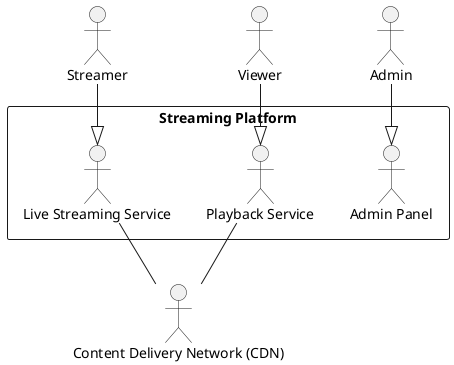
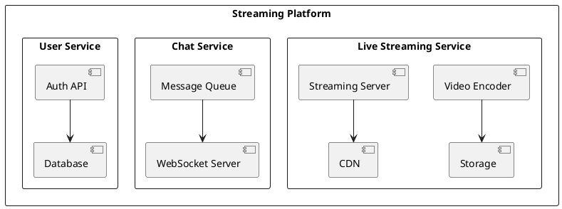

# **Архитектурное решение для видеостриминговой платформы**

## **1. Введение**
### **1.1 Цель документа**
Цель этого документа – предоставить детальное описание архитектурного решения для платформы видеостриминга, аналогичной Twitch, с учетом функциональных и нефункциональных требований, выбора архитектурного стиля, технологий и решений по безопасности, масштабируемости, отказоустойчивости и мониторингу.

### **1.2 Область применения**
Документ предназначен для использования:
- Командой архитекторов и разработчиков при проектировании системы.
- DevOps-инженерами при настройке инфраструктуры.
- Менеджерами продукта и бизнеса для оценки затрат и возможностей платформы.

---

## **2. Описание системы**
### **2.1 Обзор системы**
Система предоставляет пользователям возможность:
- Запускать видеостриминг в реальном времени.
- Просматривать трансляции с низкой задержкой.
- Общаться через встроенный чат.
- Подписываться на каналы и получать уведомления.
- Вести монетизацию через подписки, донаты и рекламу.

### **2.2 Основные пользователи**
- Стримеры (создают контент)
- Зрители (просматривают контент)
- Администраторы (управляют платформой)
- Рекламодатели (размещают рекламу)

---

## **3. Требования**
### **3.1 Функциональные требования**
- Поддержка потокового видео с низкой задержкой (<3 сек).
- Видеокодирование и трансляция в нескольких качествах (360p–4K).
- Чат в реальном времени с защитой от спама.
- Возможность монетизации (донаты, подписки, реклама).
- Поддержка мобильных устройств и Smart TV.

### **3.2 Нефункциональные требования**
- **Масштабируемость**: Поддержка миллионов пользователей в реальном времени.
- **Отказоустойчивость**: Работа без простоев при выходе из строя серверов.
- **Безопасность**: Защита от DDoS-атак, соблюдение GDPR.
- **Производительность**: Минимальная задержка передачи видео и сообщений.

---

## **4. Выбор ключевых архитектурных характеристик и обоснование**
### **Выбранные характеристики:**
1. **Масштабируемость** – критически важно, так как платформа должна поддерживать миллионы пользователей.
2. **Отказоустойчивость** – необходима, так как сбои могут привести к потере аудитории.
3. **Производительность** – низкая задержка стрима важна для UX.
4. **Наблюдаемость** – нужна для диагностики проблем в реальном времени.
5. **Интероперабельность** – интеграция с рекламными и платёжными сервисами.

Альтернативные характеристики, такие как гибкость и расширяемость, менее критичны на ранних этапах.

---

## **5. Выбор и обоснование архитектурного стиля**
### **Анализ возможных стилей**
1. **Монолит** – не подходит, так как не обеспечивает масштабируемость и отказоустойчивость.
2. **Микросервисы** – хорошая гибкость, но сложность управления.
3. **Сервисно-ориентированная архитектура (SOA)** – устаревший вариант.
4. **Space-based** – подходит для высоких нагрузок, но сложно управлять.
5. **Event-driven (событийная)** – отлично подходит для обработки стримов и чатов.

### **Выбранный стиль: Микросервисы + Event-driven**
- **Обоснование**: 
  - Разделение на сервисы повышает отказоустойчивость.
  - Событийная модель снижает задержку передачи данных в чате.
  - Горизонтальное масштабирование под нагрузки.

---

## **6. Описание архитектуры (C4)**
### **C1 – Контекстная модель**

### **C2 – Контейнерная модель**

![Схема архитектуры](http://www.plantuml.com/plantuml/png/jLRDSXmr4BxlKpI-iAvoR0euSOgz9Y4Lsp7PSimjfPdfMOlLI8kaiRDGL45ou0Pl0CKR1Cg0omx9Ayo-4IrfHfwTsIKdfyhPKQlxw_zktJUMQLiMOl0XLBzLRwlBwhgwMVoy-AbwNVrLlO7gZ-gA_cxe_xUBbqIwNho2qQVtZWMJzkJmOF01bwaeCuGpQsVcivqTpIws9zoUbKbfKATAMfHsErN5pip9aAvxncQ29pijc9s26OkQICz79C6uHBqz8zwxmSSNzixGYvcIAEyAVtykMS7JkqB7cL3p8fhlgkBNwjtY1qhy9VtTB7u9LN5DfV9lNGy_BbuEZb4R9OSNc8m49_4js3Z51C9XWqwxu2m2bOCzGo0-ICFTPYDRg8GBZEA7_hWM8N3VWWp6StAY60h5iZr6dgMeIUY0Zj2S7Se-DrRpfBHem6gMvpm5bcfb313wEK_H45e0UxwdIfanFH-cGfNPmJBqoD5WMS4cV3S0-XThU2WdNBuWxgE7Zuw-scWiIbeMFLLBnbZLDcGPB1N9QiKTO2udNL-vf2eW-XeztwzDzSRZCa4jqO6CH6aiQUl5PnfvQfQjljpAy9pp3DKZEK5ZnsID5tpcQ128uAZ1lq0mu4KWOvOvwXTCPW8RAlSyN4d8jIhgwkZ7qJD_JX79MWhhimCDdrrLnrfHi4oaMxhYUOwQT42kTC7MgHhj7qKrzEt078UJsqV1oS4v7A6zK7hQpLjKvOhVm4GeIh6OavwE8dU_JvOcp21XdD0HchC37LkbqNYOu567DjCgvowI550eq3B7r7D7iTAUkMQa7pAVfyn7U_Z44U3ZxOysOr8QOBR4MWVIkMKWIdMPWjgERXeQOvLEyRPIJcjAkqoU8XFtB2yGgE2BKjQGRRDqP2dG63QXgkav6cvmJwkfLtKOpX086v7YMihuRkXchaOma51c4IMapMfuJyCTAiafCGxPvMACQQcvdVUxheYC3S_MUkb-xr762wImbyRb91w2R-H6QiXa8J1juZSA9rCx34NWwiLkebdE92E9X-7B2RjQf6es9HFysvYIPpK1eoxCrkAYcBhcF7WCOylIQHXwaqdZAYaISyDDEzLYnJsetD7x-1Sih_VMxcmccjf-m3LUC25WUBhxm9TtZ6c8ctKnyKk9rM9n037h37rFliDSSBr8vTBBSfWWzUrMbxkVLPLyJVRSyZ_nvqO0XkDFDflMZ-F5DtwFwWR0_riUvqlFw2nEeiYqgWALiHEDllx2v_ZBWz34maUH2SZwCwmTvfLJIcF6ZODnlp1YwPaNN_umb2ByfaHfnHnOwaTxjkpqxzMVvEe_rHLKRyZZlwlBnIl_zg7ZE_S28g9x1RscyzM0Z6u_W9hDVsBSXdMtyOcpbg4cXJtVUnZKJFwslt7RqwSljMhJTjRW66LcV00wKf6bMMQH6VrD5YwYL6SNXPqH_8HSzJP2aEbDz-u43XfT8sjCaP-tHcmDqHveSGO5kMQcH1l3CA6E3qF4WAcR6l2SRAiXEztK3a2zk4sW6T_lGQXLrg4GOy7vs7BdyNqogYp4Vm00)
---

## **7. Выбор и обоснование протоколов взаимодействия и технологий**
### **Протоколы**
- **RTMP (Real-Time Messaging Protocol)** – для приема видео от стримера.
- **HLS (HTTP Live Streaming)** – для доставки видео зрителям (адаптивное битрейтовое вещание).
- **WebRTC** – альтернатива, но менее стабильная для массовых стримов.

### **Технологии**
| Компонент | Выбор | Альтернативы | Обоснование |
|-----------|------|-------------|-------------|
| Кодирование | FFmpeg | GStreamer | FFmpeg – проверенное решение с хорошей документацией. |
| CDN | Cloudflare | Akamai, AWS CloudFront | Cloudflare предлагает глобальную сеть с DDoS-защитой. |
| Чат | WebSocket + Redis | MQTT | WebSocket обеспечивает двустороннюю связь, Redis ускоряет обработку. |

---

## **8. Выбор инструментов обеспечения безопасности, масштабируемости, отказоустойчивости и производительности**
- **Безопасность**: OAuth 2.0 для аутентификации, WAF для защиты API.
- **Масштабируемость**: Kubernetes для управления микросервисами.
- **Отказоустойчивость**: Multi-region deployment в AWS/GCP.
- **Производительность**: Redis для кэширования, Nginx для балансировки нагрузки.

---

### **9. Мониторинг и наблюдаемость**
| Инструмент | Задача |
|------------|--------|
| Prometheus | Сбор метрик |
| Grafana | Визуализация |
| Loki | Логирование |
| ELK Stack | Анализ логов |
| Sentry | Трекинг ошибок |

---

## **10. Затраты на инфраструктуру
| Компонент | Стоимость (месяц) |
|------------|--------|
| AWS EC2 (10 серверов) | $5000 |
| Cloudflare CDN | $3000 |
| RDS (PostgreSQL)	 | $1000 |
| Kubernetes Cluster	 | $2000 |
| Total | $11 000 |
	
---

## **11. Основные возможные проблемы и их решения**
| Проблема | Решение |
|----------|--------|
| Высокая задержка | Оптимизация кодирования, WebRTC для VIP-стримов |
| DDoS-атаки | Использование WAF и CDN |
| Перегрузка чата | Горизонтальное масштабирование Redis |

---
